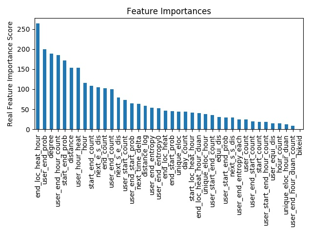

### 代码介绍
1.xgb框架 -> xgb.py + genSamples.py + genFeatures.py + genLibs.py

2.lgb框架 -> lgb.py + genSamples.py + genFeatures.py + genLibs.py

3.knn思路做推荐 -> knn.py

4.stacking框架 -> stacking.py

5.画分布直方图 -> distance_hist.py

6.多进程加速 -> mouseClick.py(借鉴文超的代码)

7.gbdt产生特征 -> gbdt_gen_features.py

8.模型调参 -> genLibs.py -> def tiaocan()

9.模型结果融合 -> avg2.py
### 总体框架
&emsp;&emsp;根据历史记录+规则构造训练集和测试集， 使用单模型(lightGBM)测试特征好坏(主要通过绘制 feature 重要性
条形图),最后使用 xgboost+lightGBM+gbdt+RF+stacking+LR 模型融合的方式预测

### 建模思路
&emsp;&emsp;首先这个问题不能使用多分类的思路解决，因为多分类的label过多。所以想到把原问题转化成一个二分类问题，具体的做法就是首先构造可能的目的地备选，然后对于每一个备选来说，相当于是一个二分类问题。  
&emsp;&emsp;在构造备选的时候又会有一个十分关键的问题，就是如何同时保证覆盖率与召回率。所谓的覆盖率是指：构造的备选中是否含有真实的目的地。所谓的召回率是指：多少个备选中才能有一个真实目的地的平均比例。在这个问题中，这两点都十分重要。在刚刚结束的商铺比赛中，我看到第一名的解法是更加偏向于覆盖率，基本上进行很少的条件过滤。在这个问题上，智者见智，在不过滤的情况下，需要很高的设备要求，因为在这种情况下，模型无疑需要通过更加高维的特征来学习到真实的目的地！
##### 我是如何构造备选的
在这个比赛中，我主要从6个角度来构造备选：  
1.用户去过的终点  
2.用户出发过的起点  
3.起点对应的终点  
4.起点的neighbor对应的终点(后加，开始没有想到) 
5.bikeid的leak地点(对于同一个bikeid，其上一条记录的终点很可能是下一条记录的起点)  
6.userid的leak地点(对于同一个userid，其上一条记录的终点很可能是下一条记录的起点)
##### 过滤异常样本
&emsp;&emsp;在上面构造备选的过程中，有一些样本是异常的，比如：骑行距离过远、骑行速度过快、骑行方向多变。对上面的样本进行过滤。
除此之外，我们对数据进行探索之后发现，在用户的骑行记录中没有正西方向的记录，所以后期把正西方向的样本也进行了过滤处理。
##### 特征工程
&emsp;&emsp;主要的特征可以参考下面的特征重要性图，有：bikeLeak,userLeak,频次,概率,熵,距离,方向,滑窗,AutoGBDT,时间,聚类等特征。在上面叙述特征的基础上使用时间进行限制产生更多维特征。

&emsp;&emsp;对于特征重要性来说，有两种类型，第一种类型是根据使用本特征的分裂节点次数(本图)，还有一种根据信息增益的大小。
##### 模型融合
&emsp;&emsp;模型融合总的来说是两种类型，第一种类型是stacking，在过程中把模型进行融合。第二种类型是结果的ensemble。从本次比赛来讲，stacking有微小的提升，但是结果的ensemble有大幅提升，结果的ensemble思路参照avg2.py。
##### 靠谱的线下验证集
&emsp;&emsp;对于数据挖掘的比赛，其实是有很多“超参”需要调节的，比如模型融合的权重，特征衰减的系数，样本过采样的比例等，但是我们总不能每一个超参都拿到线上去实验。这时候就需要构造靠谱的线下评测。线下评测的最基本要求是与线上同增减，但是更高的要求就是基本分数一致，我见过有的大神甚至可以算出自己哪些预测错了。从我自身阅读文献的经历以及和别人的探讨来说，我认为想要构造靠谱的验证集，一定要保证线上测试集与线下验证集同分布，这一点十分关键，十分关键，十分关键！重要的事情说三遍！因为说白了，模型说到底学的就是一个分布，为什么有的时候模型收敛的很慢，就是因为分布的差异性太大，所以有了batch normalization的提出，提高了模型的收敛速度。 
&emsp;&emsp;就拿这道题来说，我们对数据的探索发现，线上测试集中有一半的用户是在历史记录中没有出现过的，这就是一个很重要的分布特征。所以在构建validation dataset的时候，也一定要保证这一点。
##### 几点思考
&emsp;&emsp;这个题来说，其实是一个正负样本十分不均衡的一个例子，但是我没有解决好这个问题，始终没有找到很好，合适的策略解决这个问题。在做后一个比赛的时候，跟其他人的讨论中，知道除了过采样，欠采样之外的处理办法，也就是对边缘数据的处理办法. 
&emsp;&emsp;总的来说，还是自己没能更好的探索数据，最后明明是有机会冲进top10，但是过于急躁，没有静下心来找到更加合适的策略，希望再有机会能够弥补这个遗憾！
